# Initiator AWS Monitor

A multi-region AWS website monitoring system built with AWS CDK and TypeScript.

Initiator periodically checks configured websites, records availability and response latency, publishes custom CloudWatch metrics, triggers CloudWatch alarms, and records monitoring incidents in DynamoDB.

## Architecture

Initiator is deployed independently in two AWS regions:

- `ap-southeast-2` — Sydney
- `ap-southeast-1` — Singapore

Each regional stack contains:

- AWS Lambda — website monitoring
- Amazon S3 — website configuration
- Amazon EventBridge — scheduled monitoring
- Amazon CloudWatch — metrics, dashboards and alarms
- Amazon SNS — alert notifications
- Amazon DynamoDB — incident records

### Architecture flow

```
Website configuration
        |
        v
   Amazon S3
        |
        v
  EventBridge Rule
   every 5 minutes
        |
        v
   AWS Lambda
   /          \
  /            \
 v              v
CloudWatch    DynamoDB
 Metrics      Incidents
     |
     v
CloudWatch Alarms
     |
     v
    SNS
   Alerts
```

The same monitoring architecture is deployed independently in Sydney and Singapore.

### Multi-region deployment

Initiator uses a single CDK stack definition that is instantiated once per target region. Each instantiation creates its own fully independent set of resources — Lambda, S3, EventBridge, CloudWatch, SNS, and DynamoDB — with no cross-region dependencies. This means monitoring can continue uninterrupted from one region even if the other becomes unavailable.

> Screenshot: AWS CloudFormation stack for the Singapore deployment.
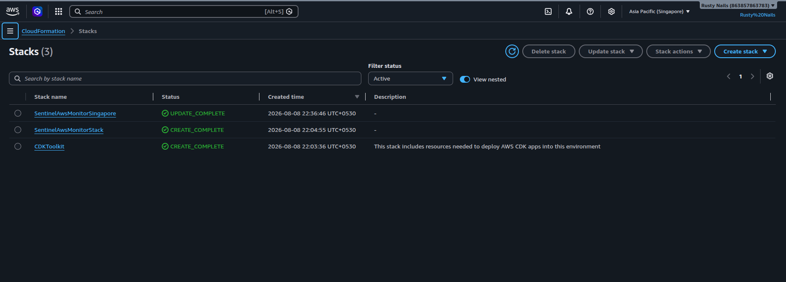

---

## Features

### Website monitoring

The Lambda function reads website configuration from:

```
config/sites.json
```

Example:

```json
{
  "sites": [
    {
      "name": "Example",
      "url": "https://example.com"
    }
  ]
}
```

For each configured website, Lambda records:

- Availability
- HTTP status code
- Response latency
- Error information when a request fails

### CloudWatch metrics

Custom metrics are published under the namespace:

```
Initiator/Monitoring
```

The application publishes:

- Availability
- Latency

Metrics use the website name as a dimension, e.g. `Site = Example`.

### CloudWatch dashboards

Each regional stack creates a regional CloudWatch dashboard. The dashboard includes:

- Website availability
- Website latency
- Lambda invocations
- Lambda errors
- Lambda duration

Dashboard names follow the regional pattern:

- `Initiator-ap-southeast-2`
- `Initiator-ap-southeast-1`

### CloudWatch alarms

Two monitoring alarms are configured:

**Availability alarm** — enters the alarm state when availability falls below the expected value.

**Latency alarm** — monitors website response latency and triggers when latency exceeds the configured threshold.

Alarm notifications are connected to an SNS topic.

### DynamoDB incident records

Monitoring incidents are stored in a regional DynamoDB table. Incident records contain:

- Incident ID
- Website name
- Website URL
- Timestamp

Each AWS region has its own incident table.

## AWS Regions

| Region | Location | Stack |
|---|---|---|
| ap-southeast-2 | Sydney | InitiatorAwsMonitorSydney |
| ap-southeast-1 | Singapore | InitiatorAwsMonitorSingapore |

The regional resources are intentionally independent so that monitoring can continue from another AWS region.

## Project structure

```
initiator-aws-monitor/
├── bin/
│   └── initiator-aws-monitor.ts
├── lib/
│   ├── lambda/
│   │   └── monitor.ts
│   └── initiator-aws-monitor-stack.ts
├── config/
│   └── sites.json
├── test/
│   └── initiator-aws-monitor.test.ts
├── images/
│   ├── Cloudwatch-Alarm.png
│   ├── CloudWatch-Singapore.png
│   ├── Cloudwatch-Stack-Singapore.png
│   ├── Cloudwatch-Sydney.png
│   ├── DynamoDB-Singapore.png
│   ├── DynamoDB-Sydney.png
│   ├── Lambda-Functions-Singapore.png
│   ├── Lambda-Functions-Sydney.png
│   ├── Singapore-CloudWatch-DashBoard.png
│   ├── SNS-Sydney.png
│   ├── SNS-Email-Notification.png
│   └── Sydney-Cloudwatch-DashBoard.png
├── package.json
├── tsconfig.json
└── README.md
```

## Prerequisites

Install:

- Node.js
- npm
- AWS CLI
- AWS CDK

Configure AWS credentials:

```bash
aws configure
```

Verify the AWS account:

```bash
aws sts get-caller-identity
```

## Install dependencies

```bash
npm install
```

## Build

Compile the TypeScript project:

```bash
npx tsc
```

## Deploy

The application contains two CDK stacks, so deploy both with:

```bash
npx cdk deploy --all
```

This deploys:

- InitiatorAwsMonitorSydney
- InitiatorAwsMonitorSingapore

## Verify deployment

List CloudFormation stacks:

```bash
aws cloudformation list-stacks \
  --query 'StackSummaries[?StackStatus==`CREATE_COMPLETE` || StackStatus==`UPDATE_COMPLETE`].StackName'
```

## Lambda Functions

Each regional stack deploys its own monitoring Lambda function.

### Sydney

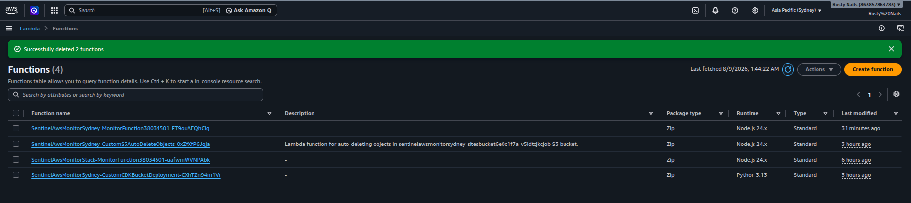

### Singapore

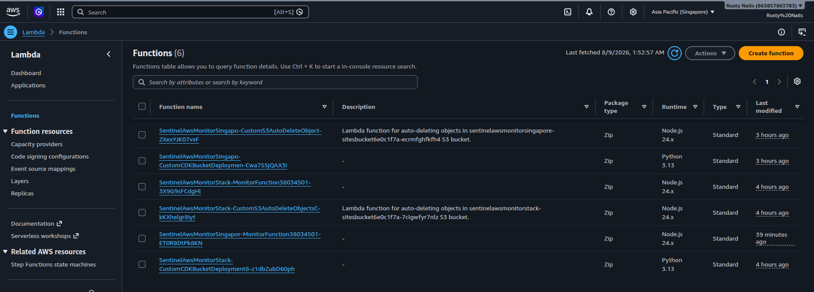

Get the Sydney Lambda name:

```bash
aws cloudformation describe-stacks \
  --stack-name InitiatorAwsMonitorSydney \
  --region ap-southeast-2 \
  --query 'Stacks[0].Outputs[?OutputKey==`MonitorFunctionName`].OutputValue' \
  --output text
```

Invoke it:

```bash
aws lambda invoke \
  --function-name "<FUNCTION_NAME>" \
  --region ap-southeast-2 \
  response.json
```

Inspect the response:

```bash
cat response.json
```

Repeat the same procedure using `ap-southeast-1` for the Singapore deployment.

---

## CloudWatch Monitoring

Initiator publishes two custom metrics for every monitored website: **Availability**, which reflects whether the site responded successfully, and **Latency**, which measures response time in milliseconds. Both metrics are broken out per site and visualized on a regional dashboard.

### Sydney Dashboard

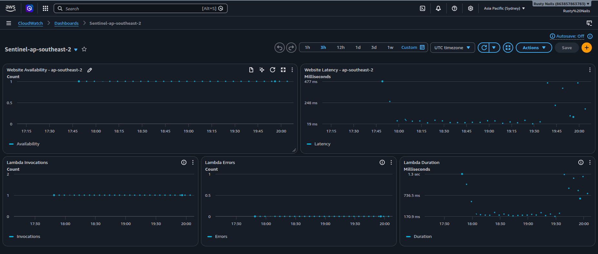

### Singapore Dashboard

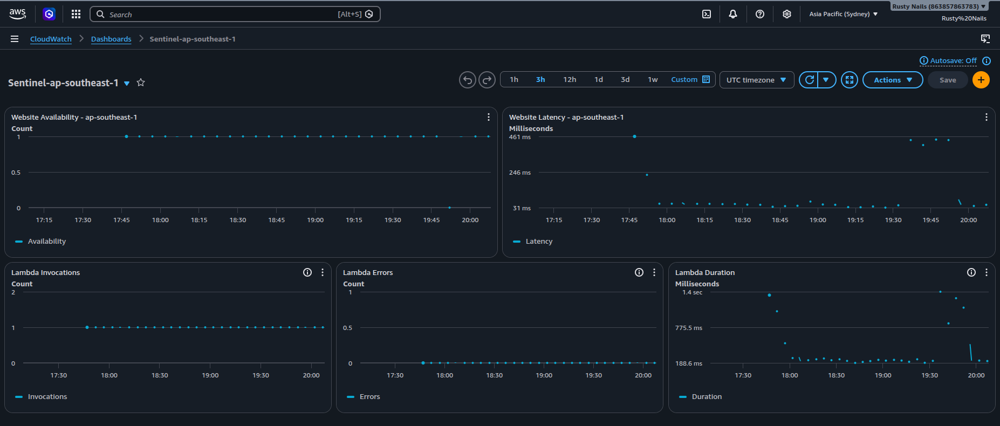

Verify metrics via CLI:

Sydney:

```bash
aws cloudwatch list-metrics \
  --namespace Initiator/Monitoring \
  --region ap-southeast-2 \
  --query 'Metrics[].{Metric:MetricName,Site:Dimensions[0].Value}' \
  --output table
```

Singapore:

```bash
aws cloudwatch list-metrics \
  --namespace Initiator/Monitoring \
  --region ap-southeast-1 \
  --query 'Metrics[].{Metric:MetricName,Site:Dimensions[0].Value}' \
  --output table
```

Expected metrics include Availability and Latency.

---

## CloudWatch Metrics

The system publishes:

- Availability
- Latency

### Sydney

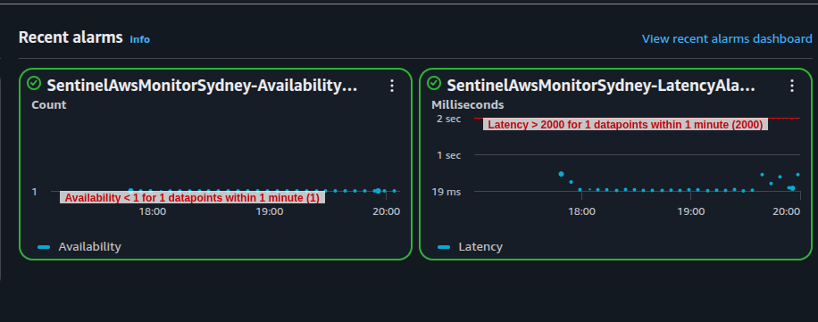

### Singapore

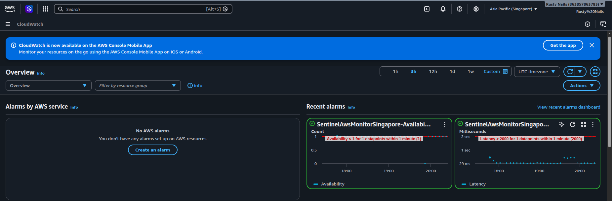

---

## CloudWatch Alarms

The system uses CloudWatch alarms for:

- Website availability
- Website latency

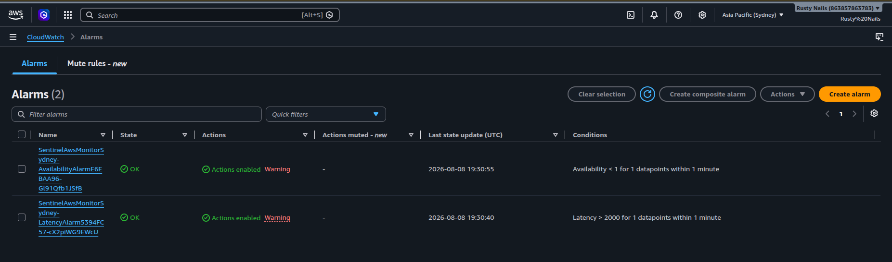

Verify alarms via CLI:

Sydney:

```bash
aws cloudwatch describe-alarms \
  --region ap-southeast-2 \
  --query 'MetricAlarms[].{Alarm:AlarmName,State:StateValue}' \
  --output table
```

Singapore:

```bash
aws cloudwatch describe-alarms \
  --region ap-southeast-1 \
  --query 'MetricAlarms[].{Alarm:AlarmName,State:StateValue}' \
  --output table
```

---

## SNS Alert Notifications

Alarm state changes are published to an SNS topic, which delivers email notifications to subscribed addresses.

### Sydney SNS Topic

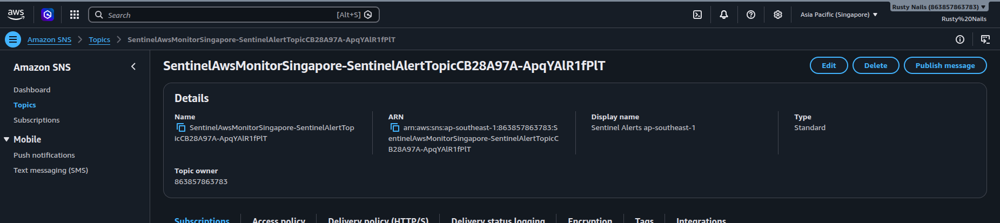

### Email Notification

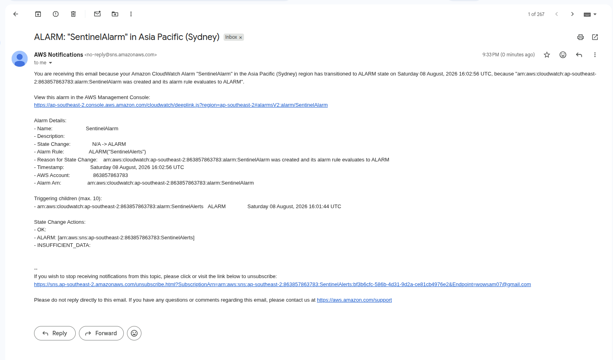

---

## DynamoDB Incident Storage

Monitoring incidents are stored in DynamoDB.

### Sydney

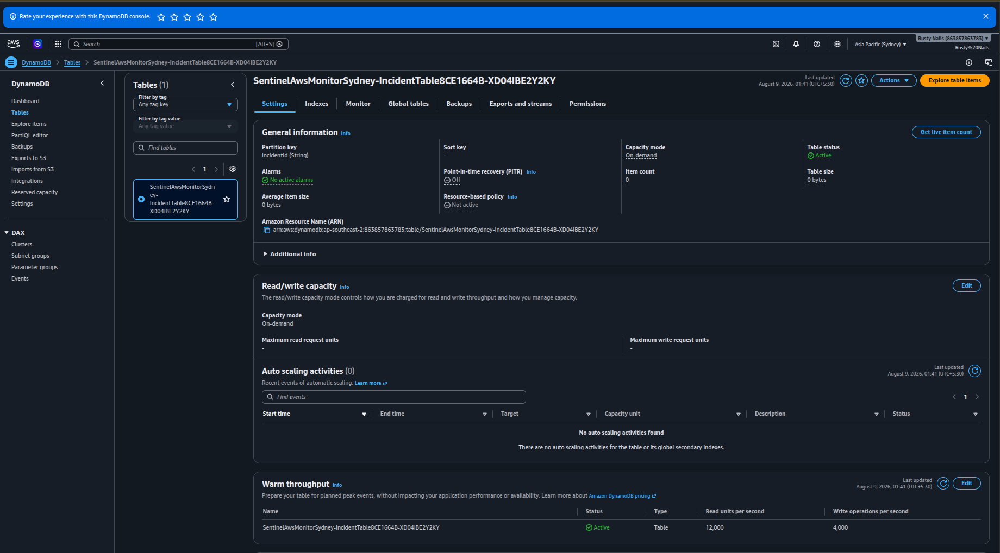

### Singapore

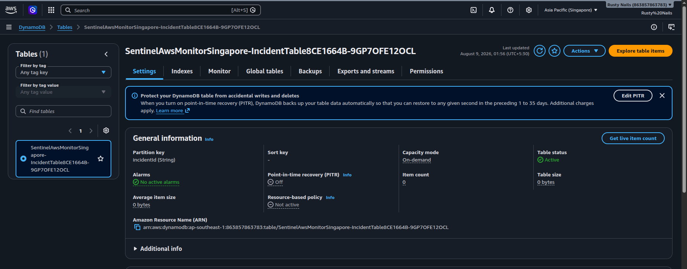

Verify tables via CLI:

Sydney:

```bash
aws dynamodb list-tables --region ap-southeast-2
```

Singapore:

```bash
aws dynamodb list-tables --region ap-southeast-1
```

---

## Monitoring schedule

EventBridge invokes the monitoring Lambda every five minutes. The Lambda:

1. Reads `sites.json` from S3.
2. Checks each configured website.
3. Measures response latency.
4. Publishes CloudWatch metrics.
5. Records incidents when monitoring detects failures.
6. Returns the monitoring results.

## Security

The architecture uses AWS IAM permissions rather than embedding credentials in application code.

The S3 configuration bucket:

- Blocks public access.
- Uses S3-managed encryption.
- Enforces SSL.
- Grants the monitoring Lambda read access.

The Lambda execution role receives only the permissions required by the application, including:

- Reading the monitoring configuration from S3.
- Publishing CloudWatch metrics.
- Writing incident records to DynamoDB.

## Multi-region design

The monitoring system is deployed in two independent AWS regions, providing regional separation:

```
                Sentinel
                   |
        +----------+----------+
        |                     |
        v                     v
   ap-southeast-2        ap-southeast-1
       Sydney                Singapore
        |                     |
      Lambda                Lambda
        |                     |
    CloudWatch            CloudWatch
        |                     |
     DynamoDB              DynamoDB
        |                     |
       SNS                   SNS
```

Regional resources are created by the same CDK stack definition and instantiated for each target region.

## Testing performed

The deployed system was verified by:

- Successful TypeScript compilation.
- Successful CDK deployment.
- Successful deployment of both regional stacks.
- Successful Lambda invocation.
- Successful website availability checks.
- Successful latency measurements.
- CloudWatch Availability metric creation.
- CloudWatch Latency metric creation.
- CloudWatch alarm creation in both regions.
- SNS email notification delivery.
- DynamoDB table creation in both regions.
- Regional separation of Sydney and Singapore resources.

## Cleanup

To remove the deployed infrastructure:

```bash
npx cdk destroy --all
```

Review the resources before confirming deletion.

## Technology stack

- TypeScript
- AWS CDK
- AWS Lambda
- Amazon S3
- Amazon EventBridge
- Amazon CloudWatch
- Amazon SNS
- Amazon DynamoDB
- AWS SDK for JavaScript v3